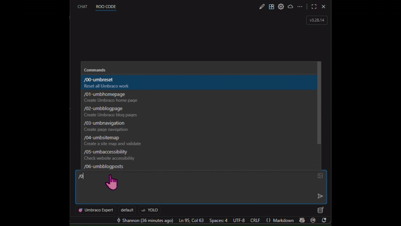
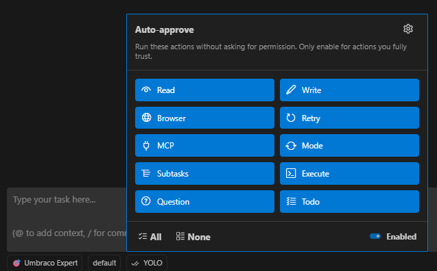
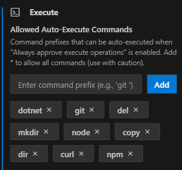

# Umbraco and Copilot CLI

Prompting, rules and instructions for facilitating Umbraco management via Copilot CLI, MCP, and AI Agents.

## Umbraco US Festival 2025 - Chicago

This project was put together as a presentation for the Umbraco US Festival 2025 in Chicago to showcase how custom rules and commands can be stored in a git repository so they can be re-used for Umbraco management.

In this demo, the premise is to have an AI Agent automatically create an Umbraco Blogging website from scratch.

## Quick Start

`TLDR;`

1. Install Playwright as admin with `npx playwright install`
1. Clone/Fork this repo and open in your Copilot-enabled editor.
1. The Umbraco website needs to be running/installed: `dotnet run --project src/MyProject/MyProject.csproj`
1. Configure MCP servers in `/.copilot/mcp-config.json`
1. [Create an Umbraco API User](https://docs.umbraco.com/umbraco-cms/fundamentals/data/users/api-users), with credentials matching `/.copilot/mcp-config.json`
1. Start Copilot CLI and run the end-to-end demo with `Use the umbraco-demo agent`
1. Or run individual skills such as `/umb-homepage`, `/umb-blog-pages`, and `/umb-navigation`



👇👇👇👇👇👇


## Using this repo

### Copilot CLI

This repository is configured for **Copilot CLI**:

* Shared instructions: `/.github/copilot-instructions.md`
* Modular instructions: `/.github/instructions/*.instructions.md`
* Reusable skills: `/.github/skills/*/SKILL.md`
* Agents: `/.github/agents/*.agent.md`
* MCP servers: `/.copilot/mcp-config.json`

### Umbraco website & Umbraco MCP

1. The Umbraco website will need to be run/installed first: `dotnet run --project src/MyProject/MyProject.csproj`
1. Read and configure Umbraco MCP: https://github.com/umbraco/Umbraco-CMS-MCP-Dev including the user information.
1. Edit `/.copilot/mcp-config.json` to update your Umbraco settings.
1. NOTE: ALL Umbraco MCP commands are marked as 'always allow', however there is this filter applied to the MCP server: "UMBRACO_INCLUDE_TOOL_COLLECTIONS": "document-type,document,media,property-type,partial-view,static-file,stylesheet,temporary-file,imaging,template".

### "YOLO mode"

Part of the presentation was to showcase that an AI Agent can autonomously do all of the work without user interaction once the rules and skills are setup. As such, several MCP tools are pre-installed in `/.copilot/mcp-config.json` with 'always allow' configured.



For this demo, other cmd line tools have been auto-allowed:



### USync

USync has been installed to this website in order to track schema and content changes in Git. This allows you to rollback/forward any changes that the Agent makes.

## End-to-end demo agent

For a single-command, fully automated demo run the `umbraco-demo` agent:

```
Use the umbraco-demo agent to build the full Umbraco blogging site
```

The agent will:
1. Ask whether to reset the site first
2. Run each skill below in sequence
3. Validate each step with Playwright before moving on
4. Summarise what was built when complete

The `umbraco-demo` agent profile lives at `/.github/agents/umbraco-demo.agent.md` and is auto-discovered by Copilot CLI.

## Skills

Reusable skills are found in `/.github/skills` and are auto-discovered by Copilot CLI.

To see available skills, run `/skills list`. Copilot can invoke these automatically, or you can call them explicitly with `/skill-name`.

Demo build order:

1. `/umb-homepage`
1. `/umb-blog-pages`
1. `/umb-navigation`
1. `/umb-sitemap`
1. `/umb-accessibility`
1. `/umb-blogposts`
1. `/umb-tagcloud`
1. `/umb-blogpost-images`

There's also a reset skill to wipe everything back to defaults: `/umb-reset`

## Custom agents

All agents are in `/.github/agents` and are auto-discovered by Copilot CLI:

* `umbraco-demo.agent.md` — end-to-end demo orchestrator
* `umbraco-site-builder.agent.md` — Umbraco implementation specialist
* `umbraco-site-validator.agent.md` — site quality and accessibility specialist

## Instructions

Instructions are found in:

* `/.github/copilot-instructions.md`
* `/.github/instructions/*.instructions.md`

These are the instructions to help keep the AI Agent doing what it is supposed to. These are currently in their infancy and although they work most of the time when running the above skills, sometimes an Agent will get something wrong. In that case, the instructions need to be adjusted.

Pro tip: You can always ask the AI Agent to update the rules in a way that it won't get something wrong again :)

## Next steps

* Maybe this could be changed to a GitHub Template Repository?
* Wonder if we can as a community come up with some great shared rulesets for Umbraco that can be confidently re-used?
* Perhaps there can be some common Umbraco slash commands that can be re-used for majority of Umbraco tasks? Slash commands for many AI tools also support command parameters which could be leveraged for added flexibility.
* Convert this to a SDD (Spec Driven Development) toolset?
* Setup a single npx command to both configure everything and potentially execute commands?
