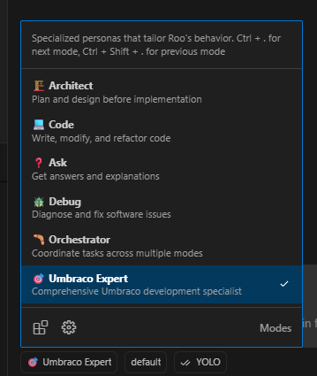

# Umbraco and AI Agents

Prompting, rules and instructions for facilitating Umbraco management via MCP and AI Agents.

## Umbraco US Festival 2025 - Chicago

This project was put together as a presentation for the Umbraco US Festival 2025 in Chicago to showcase how custom rules and commands can be stored in a git repository so they can be re-used for Umbraco management.

In this demo, the premise is to have an AI Agent automatically create an Umbraco Blogging website from scratch.

## Quick Start

`TLDR;`

1. Install Playwright as admin with `npx playwright install`
1. Clone/Fork this repo and open in VS Code.
1. The Umbraco website needs to be running/installed: `dotnet run --project src/MyProject/MyProject.csproj`
1. Ensure Umbraco MCP config is correct in the file: `/.rulesync/.mcp.json`
1. Run Rulesync: `npx rulesync generate --targets "*" --features "*"`
1. Run a slash command like: `/01-umbhomepage` to get AI to do some work.

👇👇👇👇👇👇

## Using this repo

### VSCode

All coding and interaction that was done with this repo was done with VSCode and Roo Code. Using VS and/or other AI tools like Claude might work, but I've never tested these scenarios.

### "YOLO mode"

Part of the presentation was to showcase that an AI Agent can autonomously do all of the work without user interaction once the rules and commands are setup. As such, several MCP tools are pre-installed in the file /.rulesync/.mcp.json that have 'always allow' configured.

For this demo, other cmd line tools have been auto-allowed:

### Umbraco website & Umbraco MCP

1. The Umbraco website will need to be run/installed first: `dotnet run --project src/MyProject/MyProject.csproj`
1. The tool is already installed in this workspace MCP settings file: /.rulesync/.mcp.json
1. Read and configure Umbraco MCP: https://github.com/umbraco/Umbraco-CMS-MCP-Dev including the user information.
1. Edit /.rulesync/.mcp.json to update your Umbraco settings.
1. NOTE: ALL Umbraco MCP commands are marked as 'always allow', however there is this filter applied to the MCP server: "UMBRACO_INCLUDE_TOOL_COLLECTIONS": "document-type,document,media,property-type,partial-view,static-file,stylesheet,temporary-file,imaging,template".

### Rulesync

See: https://github.com/dyoshikawa/rulesync

> A Node.js CLI tool that automatically generates configuration files for various AI development tools from unified AI rule files.

All rules, commands and MCP tool configurations are stored in /.rulesync/*. To generate the configurations for all AI tools (simplest), you can run:

`npx rulesync generate --targets "*" --features "*"`

Anytime you change a file in /.rulesync/* you will need to re-run that above command to copy the configurations to your AI tools.

### Roo Code

With Rulesync configured, you can use any of your favorite AI tools, but they will need to [support slash commands](https://github.com/dyoshikawa/rulesync?tab=readme-ov-file#supported-tools-and-features) to work properly. [Roo Code](https://docs.roocode.com/) is my tool of choice.

There's also a custom Roo Mode configured in this workspace: /.roomodes called "Umbraco Expert". This is specific to Roo Code and will allow you to choose this mode for nicer integration in running these rule/command sets.

### USync

USync has been installed to this website in order to track schema and content changes in Git. This allows you to rollback/forward any changes that the Agent makes.

## Commands

Commands are found in `/.rulesync/commands`.

The commands are numbered in order so that its easier to know which sequence they can be executed. Its not entirely criticial that they are executed in this sequence depending on the commmand being run.

To understand what each command does, just open the command file and read the instructions. You can then iterate and adjust the commands to be more specific to your needs and/or adjust the rules sets as well in case the AI Agent doesn't do exactly what you want.

1. `/01-umbhomepage`
1. `/02-umbblogpage`
1. `/03-umbnavigation`
1. `/04-umbsitemap`
1. `/05-umbaccessibility`
1. `/06-umbblogposts`
1. `/07-umbtagcloud`
1. `/08-blogpostimages` - Currently configured to use the unsplash-mcp-server

There's another command to reset everything: `/00-umbreset` which will essentially delete anything that it has already done.

## Rules

Rules are found in `/.rulesync/rules`.

These are the rules to help keep the AI Agent doing what it is supposed to. These rules are currently in their infancy and although they work most of the time when running the above commands, sometimes an Agent will get something wrong. In that case, the rules need to be adjusted.

Pro tip: You can always ask the AI Agent to update the rules in a way that it won't get something wrong again :)

## Next steps

* Maybe this could be changed to a GitHub Template Repository?
* Wonder if we can as a community come up with some great shared rulesets for Umbraco that can be confidently re-used?
* Perhaps there can be some common Umbraco slash commands that can be re-used for majority of Umbraco tasks? Slash commands for many AI tools also support command parameters which could be leveraged for added flexibility.
